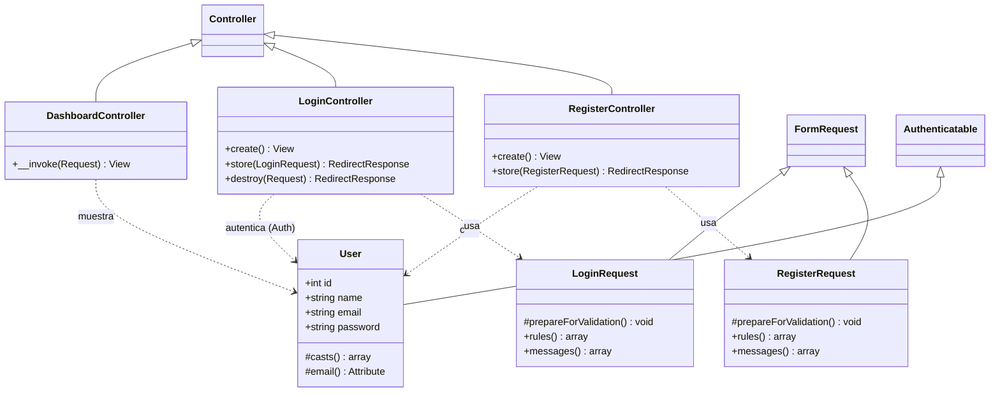
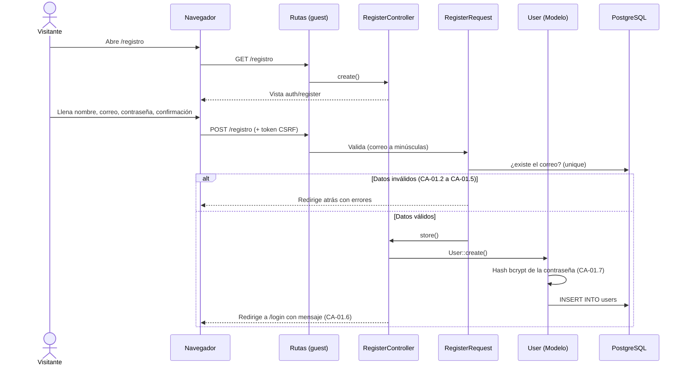
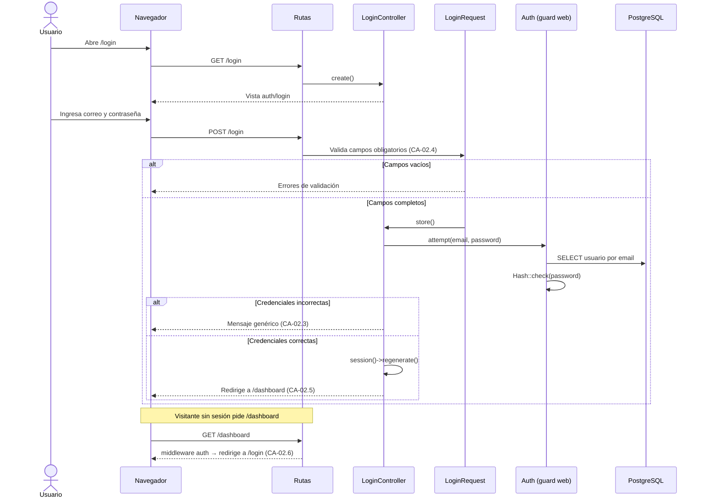

# 3. Diseño funcional (clases y secuencias)

## Diagrama de clases

```mermaid
classDiagram
    class Controller
    class RegisterController {
        +create() View
        +store(RegisterRequest) RedirectResponse
    }
    class LoginController {
        +create() View
        +store(LoginRequest) RedirectResponse
        +destroy(Request) RedirectResponse
    }
    class DashboardController {
        +__invoke(Request) View
    }
    class FormRequest
    class RegisterRequest {
        #prepareForValidation() void
        +rules() array
        +messages() array
    }
    class LoginRequest {
        #prepareForValidation() void
        +rules() array
        +messages() array
    }
    class User {
        +int id
        +string name
        +string email
        +string password
        #casts() array
        #email() Attribute
    }
    class Authenticatable

    Controller <|-- RegisterController
    Controller <|-- LoginController
    Controller <|-- DashboardController
    FormRequest <|-- RegisterRequest
    FormRequest <|-- LoginRequest
    Authenticatable <|-- User
    RegisterController ..> RegisterRequest : usa
    RegisterController ..> User : crea
    LoginController ..> LoginRequest : usa
    LoginController ..> User : autentica (Auth)
    DashboardController ..> User : muestra
```

## Secuencia HU-01 — Registro

```mermaid
sequenceDiagram
    actor V as Visitante
    participant N as Navegador
    participant R as Rutas (guest)
    participant C as RegisterController
    participant F as RegisterRequest
    participant U as User (Modelo)
    participant DB as PostgreSQL

    V->>N: Abre /registro
    N->>R: GET /registro
    R->>C: create()
    C-->>N: Vista auth/register
    V->>N: Llena nombre, correo, contraseña, confirmación
    N->>R: POST /registro (+ token CSRF)
    R->>F: Valida (correo a minúsculas)
    F->>DB: ¿existe el correo? (unique)
    alt Datos inválidos (CA-01.2 a CA-01.5)
        F-->>N: Redirige atrás con errores
    else Datos válidos
        F->>C: store()
        C->>U: User::create()
        U->>U: Hash bcrypt de la contraseña (CA-01.7)
        U->>DB: INSERT INTO users
        C-->>N: Redirige a /login con mensaje (CA-01.6)
    end
```

## Secuencia HU-02 — Inicio de sesión

```mermaid
sequenceDiagram
    actor U as Usuario
    participant N as Navegador
    participant R as Rutas
    participant C as LoginController
    participant F as LoginRequest
    participant A as Auth (guard web)
    participant DB as PostgreSQL

    U->>N: Abre /login
    N->>R: GET /login
    R->>C: create()
    C-->>N: Vista auth/login
    U->>N: Ingresa correo y contraseña
    N->>R: POST /login
    R->>F: Valida campos obligatorios (CA-02.4)
    alt Campos vacíos
        F-->>N: Errores de validación
    else Campos completos
        F->>C: store()
        C->>A: attempt(email, password)
        A->>DB: SELECT usuario por email
        A->>A: Hash::check(password)
        alt Credenciales incorrectas
            C-->>N: Mensaje genérico (CA-02.3)
        else Credenciales correctas
            C->>C: session()->regenerate()
            C-->>N: Redirige a /dashboard (CA-02.5)
        end
    end

    Note over N,R: Visitante sin sesión pide /dashboard
    N->>R: GET /dashboard
    R-->>N: middleware auth → redirige a /login (CA-02.6)
```
